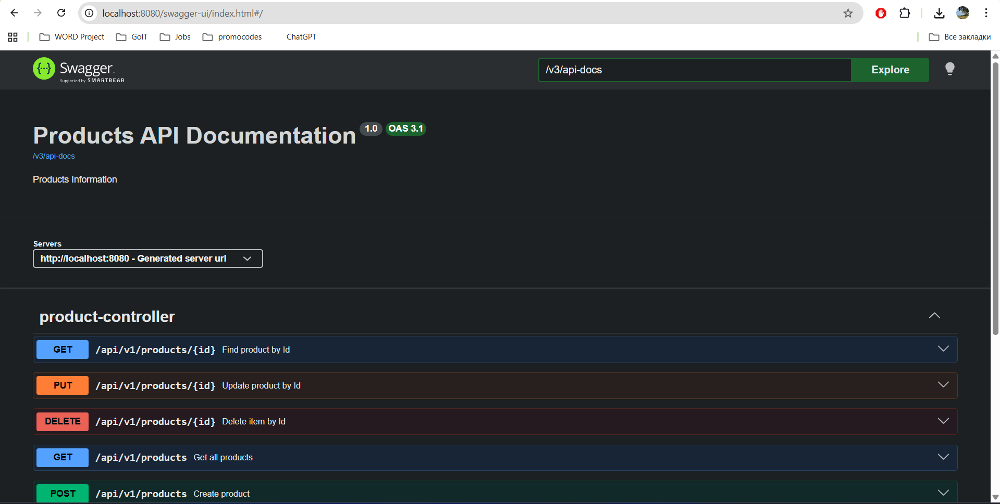

# Project 2 (Java Sprinboot CRUD-application)
This is a simple Java Springboot REST API application that has 5 endpoint to manage products in the H2 database. 
The application is documented and can be tested via [Swagger UI](http://localhost:8080/swagger-ui/index.html#/):

# Get started
To get started you have to clone this repository and run main  file - FirstRestApiApplication
After that, you can test the application via Swagger-UI or Postman. Also, you can manage your database via [H2-Console](http://localhost:8080/console/).

After launching your application and going to [Swagger UI](http://localhost:8080/swagger-ui/index.html#/), you will see five endpoints:

# Controllers
The first thing that should be mentioned, is that the API is versioned (v1). 
These 5 endpoints are representing main 4 HTTP-methos (GET, PUT, POST, DELETE).
- GET /api/v1/products/{id} - get product info by id
- PUT /api/v1/products/{id} - change product info by id
- DELETE /api/v1/products/{id} - delete product by id
- GET /api/v1/products/ - get all products' info
- POST /api/v1/products/ - to create new product in DB.

# Testing Workflow
Follow this workflow to test the application:
1. We should create 3 products via POST /api/v1/products/ (they will get ids 1, 2, 3)
2. Pick an id of a random product that was created before to its info. Use GET /api/v1/products/1 to get the product info. If you pick a product with id that is not in the database you will get 404 response.
3. Use PUT /api/v1/products/1 to change the name of the first product.
4. Use DELETE /api/v1/products/2 to delete the second product from DB.
5. USE GET /api/v1/products/ to get all products' info. You will see that in response we will get only 2 products: The first product with a new name and the third product with initial name.